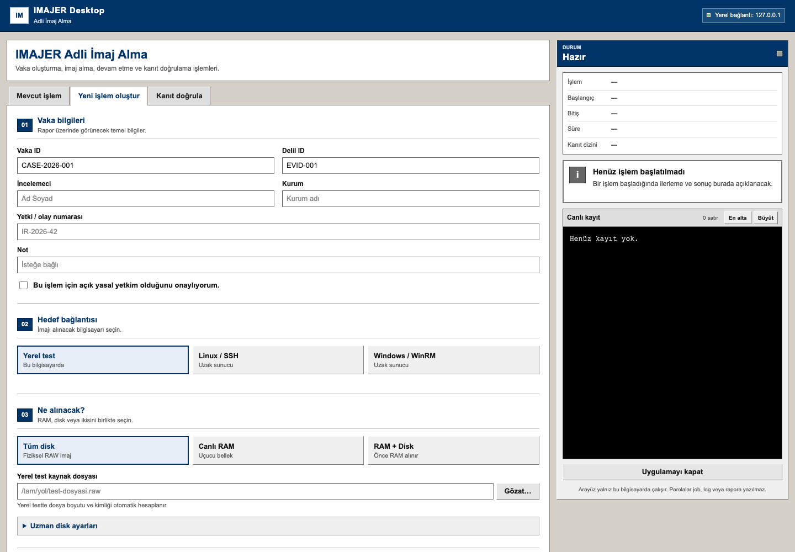
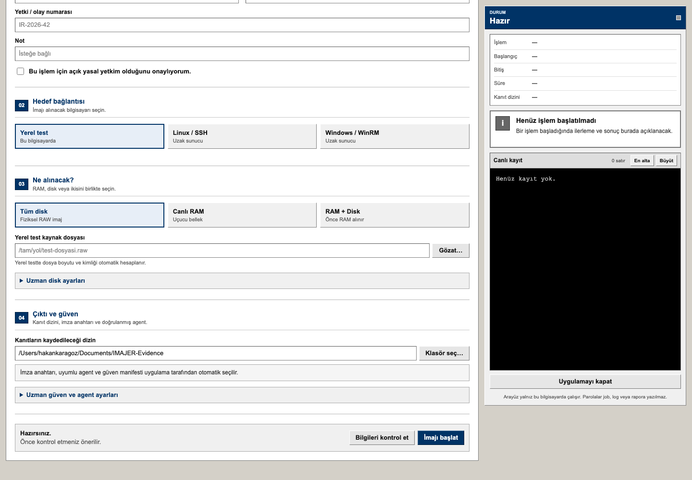
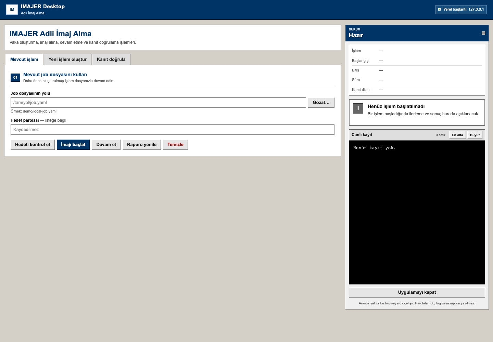
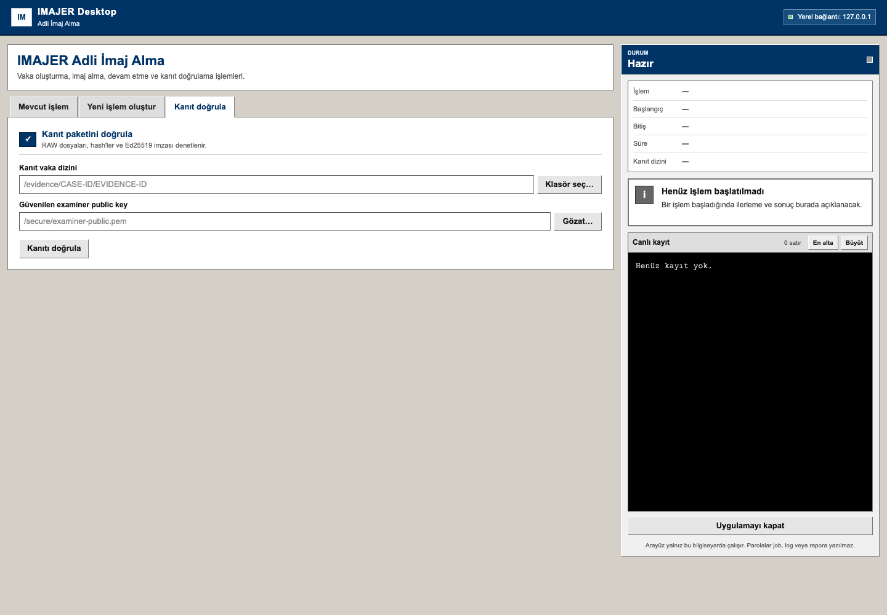

# IMAJER 0.6.8 — Proje Özeti ve Ekip Hızlı Kullanım

Bu belge, IMAJER ile disk veya RAM imajı alacak ekip üyeleri için kısa kullanım
özetidir.

> IMAJER'i yalnızca açık yasal yetki bulunan sistemlerde kullanın.

## Projenin kısa anlatımı

### Problem nedir?

Olay müdahalesinde incelenecek sunucu başka bir şehirde, veri merkezinde veya
erişimi zor bir ortamda olabilir. Diski fiziksel olarak sökmek hizmet
kesintisine yol açabilir. Uzak bağlantıyla alınan verinin değişmediğinin,
eksiksiz geldiğinin ve sonradan manipüle edilmediğinin de kanıtlanması gerekir.

### Nasıl bir çözüm üretildi?

IMAJER, uzak Linux veya Windows sunucusundaki disk/RAM verisini hedefte tam bir
imaj ya da staging dosyası oluşturmadan doğrudan incelemecinin yerel kanıt
deposuna aktarır. Veri 8 MiB parçalar halinde iletilir; parça, oturum ve tam
dosya SHA-256 değerleri hesaplanır. Merkle root, zaman çizelgesi, imzalı kanıt
indeksi ve PDF/JSON rapor oluşturulur. Disk aktarımı kesilirse doğrulanmış
ofsetten güvenli biçimde devam edilebilir.

Linux RAM ediniminde paket içindeki imzalı Microsoft AVML 0.20 kullanılır.
AVML veriyi hedefte yalnız `127.0.0.1` üzerinde açılan geçici TCP soketiyle
IMAJER agent'a verir. RAM imajı hedef diske yazılmaz; agent veriyi doğrudan
incelemeci bilgisayarına aktarır.

### Hangi teknolojiler kullanıldı?

- Go 1.26 ve CGO'suz, çok platformlu binary'ler
- Linux için SSH/SFTP, Windows için HTTPS üzerinden WinRM
- Salt-okunur disk erişimi ve framed binary streaming
- SHA-256, sıralı Merkle root ve Ed25519 dijital imza
- JSON/JSONL kayıtları, RAW imaj parçaları ve PDF rapor
- Yalnız `127.0.0.1` üzerinde çalışan masaüstü arayüz
- İmzalı agent/tool manifesti ve uzak dosya hash doğrulaması
- Linux RAM için AVML 0.20 ve hedef içinde loopback-only TCP streaming

### Piyasadaki hangi açığı kapatıyor?

Birçok klasik imaj alma akışı diskin incelemeciye fiziksel olarak bağlanmasını
veya uzak hedefte önce büyük bir imaj/staging dosyası oluşturulmasını bekler.
Dosya-hedefli FTK benzeri standart akışlar da katı
**zero-image-footprint** ihtiyacına doğrudan uymaz. IMAJER; uzak sunucudan
doğrudan akış, yerel parçalı kayıt, kesintiye dayanıklı devam, imzalı araç
doğrulaması ve hedefte kontrollü temizlik özelliklerini tek akışta birleştirerek
bu ihtiyaca odaklanır. Piyasadaki tüm adli araçların yerine geçmeyi değil, uzak
ve izlenebilir edinim boşluğunu kapatmayı amaçlar.

### Nerelerde kullanılabilir, yaygın etkisi nedir?

- SOC ve DFIR olay müdahale ekipleri
- Veri merkezi, uzak ofis ve şube sunucuları
- Bulut/VM ve fiziksel sunucu incelemeleri
- Kurum içi suistimal ve zararlı yazılım vakaları
- Adli bilişim eğitimi ve laboratuvar demoları

Sahaya gitme ve diski sökme ihtiyacını azaltır; delilin daha hızlı,
tekrarlanabilir ve denetlenebilir biçimde toplanmasını sağlar.

## Uygulamalı demo akışı

Sunum sırasında aşağıdaki kısa akış gösterilebilir:

1. Yetkili laboratuvar Linux sunucusuna SSH bilgilerini girin.
2. **Bağlan ve diskleri getir** ile hedefi ve disk kimliğini doğrulayın.
3. Küçük bir sentetik RAW kaynak seçip imajı başlatın.
4. Canlı kayıtta chunk ilerlemesini ve SHA-256 doğrulamasını gösterin.
5. İmaj bittikten sonra **Kanıt doğrula** işlemini çalıştırın.
6. `ACQUISITION_VERIFIED`, `PACKAGE_INTEGRITY_OK` ve `case-report.pdf`
   çıktısını gösterin.

Bu demo, gerçek üretim diski yerine izinli ve sentetik bir test kaynağıyla
yapılmalıdır.

## 0.6.5 doğrulama özeti

Yetkili AWS Linux `amd64` laboratuvar hedefinde uygulamalı doğrulama yapıldı:

- AVML ile 1.023.342.556 byte RAM tek kesintisiz oturumda, sıfır retry ile
  `verified_continuous` olarak doğrulandı.
- 8 GiB Amazon EBS disk aktarımı iki gerçek ağ kesintisinden sonra doğrulanmış
  ofsetlerden devam etti; 1024 adet 8 MiB chunk ile
  `chunk_verified_composite` tamamlandı.
- İmzalı evidence index bağımsız `verify` işleminden geçti.
- Son cleanup geçici AVML, agent ve case marker dosyalarını kaldırdı.

Bu test, genel `exit status 1` mesajının tek başına imajın bozuk olduğu anlamına
gelmediğini gösterdi. İki ara çalışma ağ kesintisiyle kapanmasına rağmen disk
state'i korunmuş, sonraki resume sonunda tam ve doğrulanmış kanıt paketi
oluşmuştur.

## 1. Uygulamayı açın

- **Windows:** ZIP paketini tamamen çıkarın ve `IMAJER.exe` dosyasını açın.
- **macOS:** `IMAJER.app` dosyasını açın.
- Sağ üstte **Yerel bağlantı: 127.0.0.1** yazdığını kontrol edin.

Arayüz yalnızca kullanılan bilgisayarda çalışır. Girilen parola job dosyasına,
rapora veya loglara kaydedilmez.

## 2. Yeni işlem oluşturun

**Yeni işlem oluştur** sekmesine geçin.

1. **Vaka ID** ve **Delil ID** alanlarına benzersiz değerler yazın.
2. İncelemeci, kurum ve yetki/olay numarasını doldurun.
3. Yasal yetki kutusunu yalnızca yetkiniz varsa işaretleyin.
4. Hedef türünü seçin: **Yerel test** bu bilgisayardaki normal bir test dosyası,
   **Linux / SSH** uzak Linux sunucusu, **Windows / WinRM** uzak Windows
   sunucusu içindir.
5. Uzak hedefte sunucu, kullanıcı ve bağlantı bilgilerini girip
   **Bağlan ve diskleri getir** düğmesine basın. Doğru diski model, seri numarası
   ve boyutuyla kontrol ederek seçin.

Ardından alınacak veri ile çıktı konumunu belirleyin.

1. **Tüm disk**, **Canlı RAM** veya **RAM + Disk** seçin.
2. Yerel testte kaynak dosyayı; uzak işlemde listelenen doğru diski seçin.
3. Kanıtların kaydedileceği dizini seçin. Yeterli boş alanı olan ayrı bir kanıt
   diski kullanın.
4. Önce **Bilgileri kontrol et**, ardından **İmajı başlat** düğmesine basın.
5. Sağdaki **Durum** ve **Canlı kayıt** alanlarını işlem bitene kadar izleyin.

İşlem sırasında uygulamayı kapatmayın, hedef bağlantısını kesmeyin ve kanıt
diskini çıkarmayın.

## 3. Hazır job dosyasıyla çalışın

Daha önce hazırlanmış bir job dosyanız varsa **Mevcut işlem** sekmesini
kullanın.

1. **Gözat** ile `job.yaml` dosyasını seçin.
2. Gerekiyorsa hedef parolasını girin.
3. Önce **Hedefi kontrol et** düğmesine basın.
4. Yeni edinim için **İmajı başlat**, yarım kalan disk edinimi için
   **Devam et** düğmesini kullanın.

**Temizle** düğmesi kanıtı silmek için değildir; hedefte kalmış geçici IMAJER
agent/araç izlerini temizlemek içindir.

## Bağlantı kesilir veya `exit status 1` görülürse

`exit status 1` tek başına kök neden değildir; yalnız alt sürecin başarısız
kapandığını söyler. **Canlı kayıt** alanında bu satırdan önceki ayrıntıyı ve
vaka dizinindeki `events.jsonl` ile `state.json` dosyalarını kontrol edin.

- Disk aktarımı kesildiyse aynı job dosyasıyla **Devam et** kullanılır. Program
  doğrulanmış son ofsetten devam eder. Son durum `chunk_verified_composite`
  olabilir; tüm parçalar doğrulanır fakat canlı disk farklı zamanlarda okunmuş
  olur.
- RAM kaldığı yerden devam etmez. Yeniden başlatmada sıfır ofsetten yeni bir
  `memory-attempt-NNN` üretilir. Birden fazla tamamlanmış RAM imajının farklı
  SHA-256 değerlerine sahip olması normaldir; canlı bellek zamanla değişir.
- `RAM + Disk` işleminde disk kesilip işlem yeniden başlatılırsa önce yeni bir
  RAM snapshot'ı alınır, ardından disk kaldığı yerden sürer.
- Son kararı ekrandaki genel hata yerine **Kanıtı doğrula** sonucu verir.
  `ACQUISITION_VERIFIED` ve `PACKAGE_INTEGRITY_OK` görülmeden teslim yapmayın.

Varsayılan 8 MiB chunk boyutu hız, yeniden deneme maliyeti ve hash kayıt
yoğunluğu arasında dengedir. Tek başına bağlantı hızını belirlemez; gerçek hız
ağ, SSH/WinRM, hedef disk/RAM okuması ve yerel kanıt diski tarafından sınırlanır.

## 4. Kanıtı doğrulayın

İmaj alma bittikten sonra mutlaka **Kanıt doğrula** sekmesine geçin.

1. Vaka içindeki ilgili delil dizinini seçin:
   `.../CASE-ID/EVIDENCE-ID`
2. Mümkünse bağımsız ve güvenilen examiner public key dosyasını seçin.
3. **Kanıtı doğrula** düğmesine basın.
4. Sağ panelde başarılı doğrulama sonucunu kontrol edin. Canlı kayıtta
   `ACQUISITION_VERIFIED` ve `PACKAGE_INTEGRITY_OK` görülmelidir.

## İşlem sonunda

Kanıt dizininde genel olarak şunlar bulunur:

- Parçalı RAW imaj dosyaları
- `case-report.pdf` ve `case-report.json`
- Hash, oturum ve olay kayıtları
- İmzalı `evidence-index.json`

Bu dizindeki dosyaları tek tek taşımayın veya değiştirmeyin. Teslim, kopyalama
ve arşivleme işlemlerinde vaka/delil dizininin tamamını birlikte koruyun.

## Kısa kontrol listesi

- [ ] Yasal yetki doğrulandı.
- [ ] Doğru hedef ve doğru fiziksel disk seçildi.
- [ ] Kanıt diskinde yeterli boş alan var.
- [ ] İmaj alma başarıyla tamamlandı.
- [ ] Kanıt doğrulaması başarıyla geçti.
- [ ] `exit status 1` varsa önceki ayrıntılı hata ve resume kayıtları incelendi.
- [ ] `chunk_verified_composite` ise canlı diskin farklı zamanlarda okunduğu not edildi.
- [ ] PDF rapor ve kanıt dizini birlikte teslim edildi.
